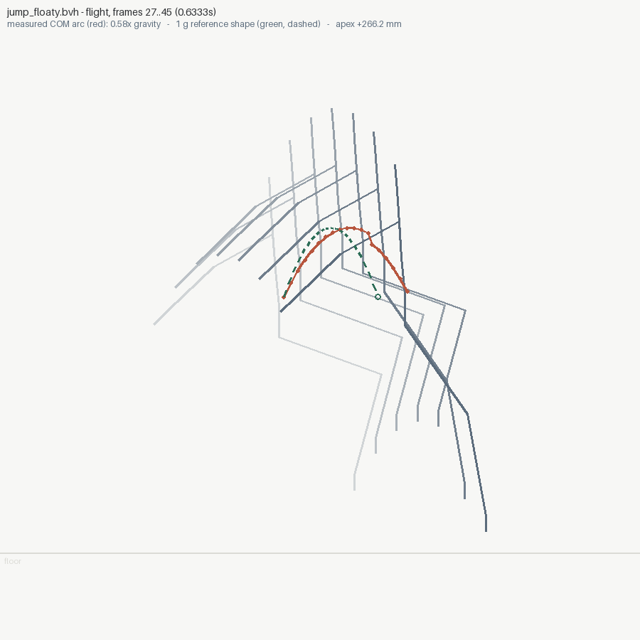
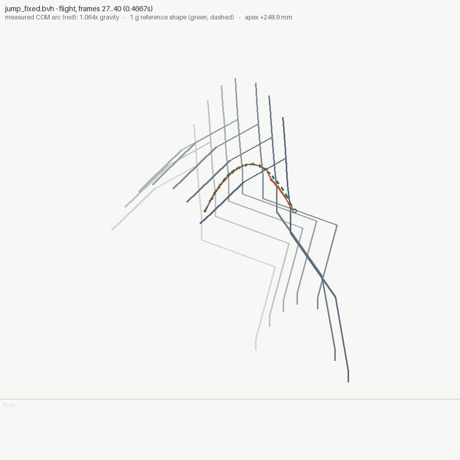

# 02 — The floaty jump (before / after)

A full standing long-jump — crouch, drive, travelling flight, landing
absorb 60 cm ahead, recovery — written twice by `make_jump.py`. The two
clips have IDENTICAL poses; only the flight's timing differs:

| | measured apex | forward travel | measured airtime | effective gravity |
|---|---|---|---|---|
| `jump_floaty.bvh` | +266 mm | 600 mm | 0.633 s (+36%) | **0.58x g** |
| `jump_fixed.bvh` | +249 mm | 600 mm | 0.467 s | **1.064x g** |

(The measured flight is the span where BOTH feet are above contact
height — shorter than the authored keyframe span, because takeoff
extension and landing absorb keep a foot low at each end.)

That is exactly why the defect is invisible to inspection: every still
frame of both clips is a fine jump pose. Floatiness lives in time.

```bash
animationsight inspect jump_floaty.bvh --kind oneshot --out out_floaty
animationsight inspect jump_fixed.bvh  --kind oneshot --out out_fixed
animationsight diff jump_floaty.bvh jump_fixed.bvh --kind oneshot
```

## The arc sheet makes time visible

`inspect` writes `flight_0_arc.png` for any clip with a flight: ghosted
poses across the jump, the measured COM arc in red (one dot per frame),
and dashed in green the arc physics would draw — same takeoff velocity,
same apex, landing where 1 g says (`T = 2*sqrt(2h/g)`, so the reference
is `sqrt(g_ratio)` as wide).

<p align="center">
  
  
</p>
<p align="center"><em>left, the floaty take: the red measured arc overshoots the green 1 g reference by a third of the jump. right, the fix: the two arcs coincide.</em></p>

## The findings

```
# floaty:
flight: frames 27..45 (0.6333s, apex +266.2 mm) -> 0.58x gravity
[WARN] flight at frames [27, 45] falls at 0.58x gravity: it will read as floaty
       where: apex +266.2 mm over 0.6333s; at 1 g that apex takes 0.47s of airtime
       try:   physics fixes it two ways: shorten the airtime to match the apex,
              or raise the apex to match the airtime (T = 2*sqrt(2h/g))

# fixed:
flight: frames 27..40 (0.4667s, apex +248.9 mm) -> 1.064x gravity
(no floaty-flight finding)
```

## The diff is the proof

```
animationsight diff jump_floaty.bvh jump_fixed.bvh --kind oneshot
  timing: 71 frames @ 30.0 fps -> 65 @ 30.0
  flight 0: 0.58x gravity (0.6333s) -> 1.064x gravity (0.4667s)
  'Spine': peak speed 1852.4 -> 2405.5 mm/s (+553.1)
  ... and N more joint(s) with peak-speed changes ...
  GONE [floaty-flight] flight at frames [27, 45] falls at 0.58x gravity ...
```

(Flights lead the diff, and near-identical per-joint peak lines fold
into one — both changes came from using this very example and finding
the headline buried.)

Both clips also report their pose snaps honestly: this is a
blocking-pass jump with instantaneous pose changes, and `--kind
oneshot` silences only the loop check, never the snaps.
