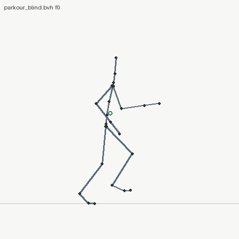
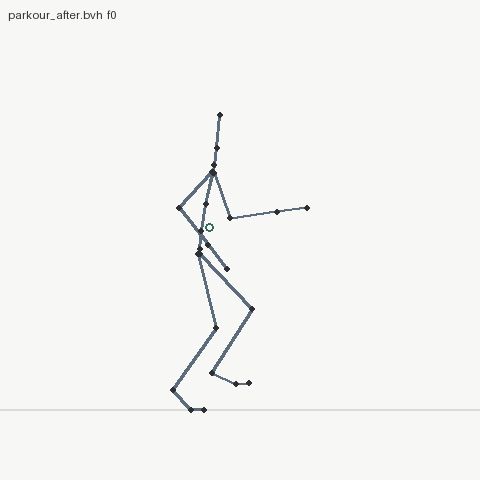
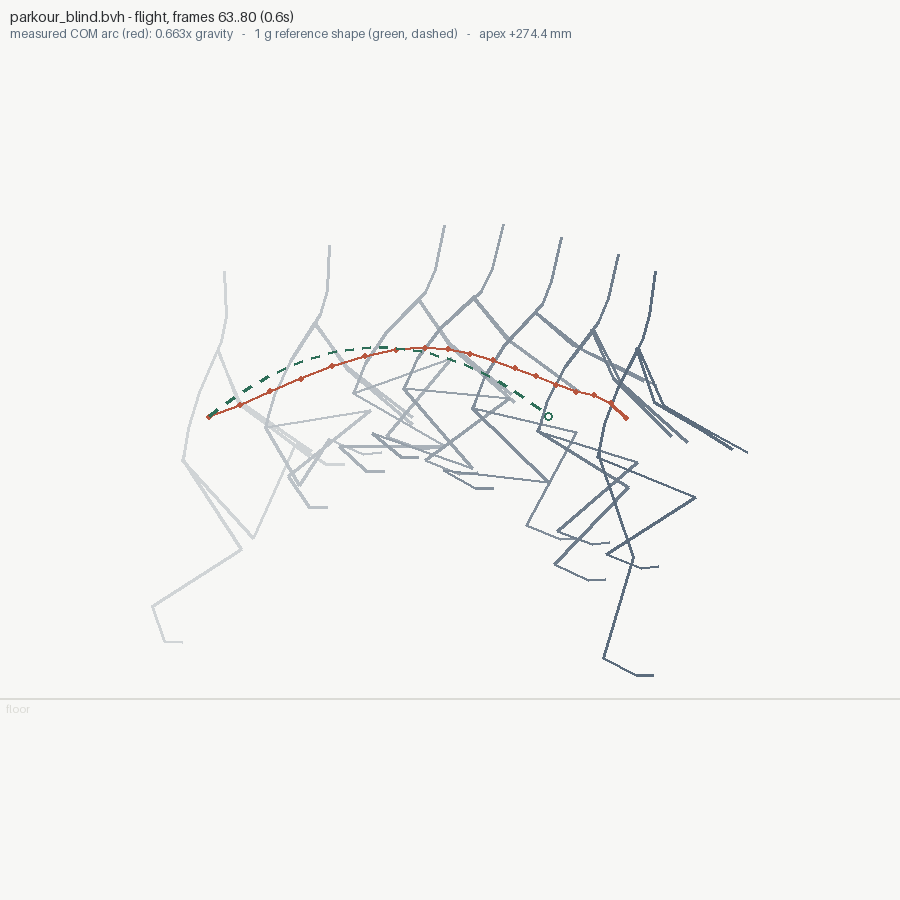
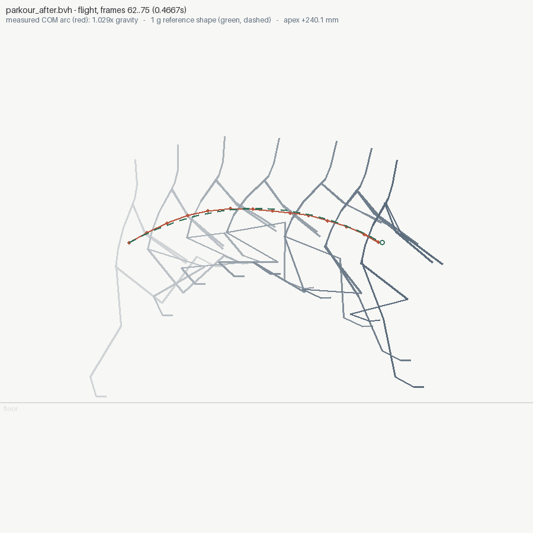

# 03 — parkour vault: blind vs measured

The commission: a 240-frame, 21-joint parkour sequence — approach run,
kong vault over a 0.9 m obstacle, landing absorption, 90° turn, jog
out, settle. Two attempts at the SAME brief:

- **`parkour_blind.bvh`** — authored by a cold-context agent with no
  tools at all: no renderer, no metrics, numpy and arithmetic only,
  one shot. (`make_blind.py`)
- **`parkour_after.bvh`** — the same clip taken through the
  animationsight loop: audit, fix what the numbers say, re-audit until
  clean. (`make_after.py`)

| | blind | after |
|---|---|---|
| run stride flights | 0.47–0.67× gravity | 1.15–1.18× gravity |
| vault flight | 0.66× gravity (0.6 s hang) | **1.03× gravity** (0.47 s) |
| foot sliding | 10.95 mm skate at landing | none |
| outbound jog steps | root glides airborne ("on rails") | ballistic |
| verdict | `WARNINGS` (7 findings) | **`OK` (0 findings)** |

| blind | after |
|---|---|
|  |  |

## What the blind agent got right

Credit where due: the structure is genuinely good. Authored contact
schedule driving analytic 2-bone leg IK (stance feet mathematically
pinned), yaw-outermost rotation order so the 90° turn stays clean,
hand-solved obstacle clearances, believable phase timing. The skeleton,
format, and winding were all correct on the first run. **What it could
not do blind is physics** — and none of these defects are visible in a
single frame:

## What the audit measured, and the fix for each

**Floaty flights (5 spans, 0.28–0.67× g).** During flight the COM has
no choice: it falls at 9.81 m/s². The blind vault hung 0.73 s over a
+297 mm apex — 1 g gives that apex only 0.49 s (`T = 2*sqrt(2h/g)`).
The fix: airborne root height is a true parabola at 981 cm/s² inside
every flight window (with a 0.08 s C1 blend at the edges), and the
vault airtime was shortened to what its apex buys.

vault arc, measured against the dashed 1 g reference:

| blind — the wide arc is the giveaway | after — arcs coincide |
|---|---|
|  |  |

**Foot sliding (10.95 mm, worst at frame 89).** The landing step-through
was still moving 84 mm/s horizontally below plant height. Fix: swings
*peel, swing, arrive* — the ball holds its horizontal position 0.07 s
past toe-off, and horizontal travel completes 0.12 s before touchdown
with the last 8 cm vertical.

**Root on rails (3 outbound steps).** Both feet airborne while the COM
glided at constant height — jog steps with no ballistics. The same
parabola windows cover them: each step now drops `g*(T/2)²/2`.

**The bug nobody authored: IK overreach.** Measuring the audited clip
showed late stance demanding 85–91 cm of hip→ankle distance from an
83.7 cm leg; the IK clamp then dragged the planted ball off the floor
~3 frames early, smearing every flight fit and skating the toe. The
approach plants moved 15–25 cm forward, and `make_after.py` now
*asserts* every stance stays inside reach. This defect is in the blind
clip too — it just hid inside the floaty readings.

## What this example forced INTO the tool

Dogfooding cuts both ways; auditing these clips exposed three tool
defects, each now fixed and regression-tested:

- **`root-on-rails` finding.** The flat outbound steps used to be
  blamed on `--unit` ("-0.05× gravity"). A parabola fitted to a flat
  line measures nothing — and a *negative* ratio can never be a unit
  error, units scale positively. Rails is its own finding with its own
  fix now.
- **Height-only airborne detection.** "Planted" (for sliding) needs
  height AND low speed, but "airborne" (for ballistics) is height
  only: a foot at 1 mm bears load however fast it moves, and the speed
  gate's ±2-frame gradient smear dragged grounded frames into short
  flights — misreading a *physical* run stride as 0.4 g floaty.
- **`--kind oneshot` polish.** `inspect` no longer prints a misleading
  `loop: DISCONTINUOUS` line for a clip that is not supposed to loop,
  and `diff` accepts `--kind` so the seam doesn't spam the comparison.

## The receipts

```text
$ animationsight diff parkour_blind.bvh parkour_after.bvh --kind oneshot
diff: parkour_blind.bvh [warnings] -> parkour_after.bvh [ok]
  flight 0: 0.669x gravity (0.1667s) -> 1.153x gravity (0.1667s)
  flight 1: 0.467x gravity (0.2s)    -> 1.184x gravity (0.1667s)
  flight 2: 0.663x gravity (0.6s)    -> 1.029x gravity (0.4667s)
  GONE [floaty-flight] x3
  GONE [foot-sliding]  x4
```

## Reproduce

```bash
python make_blind.py && python make_after.py
animationsight inspect parkour_blind.bvh --kind oneshot --out audit_blind --gif
animationsight inspect parkour_after.bvh --kind oneshot --out audit_after --gif
animationsight diff parkour_blind.bvh parkour_after.bvh --kind oneshot
```
