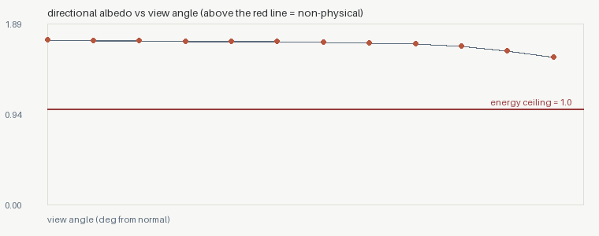
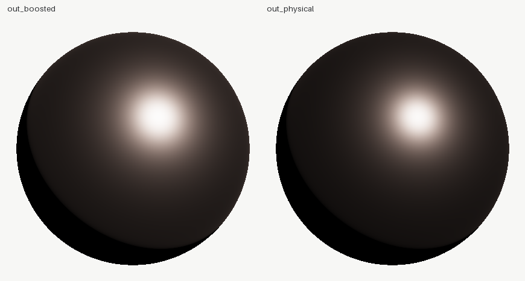

# 03 — The intensity slider, measured (before / after)

Every engine has the slider: "specular boost", "intensity", "energy".
Artists reach for it because it is fast. This example measures what it
actually does.

```bash
shadersight material --preset copper --roughness 0.3 --boost 1.8 --out out_boosted
shadersight material --preset copper --roughness 0.3             --out out_physical
shadersight diff out_boosted out_physical
```

## Before: boost = 1.8

```
shadersight material: FAILED
  energy: max albedo 1.71766 at 0.0 deg -> VIOLATES
  [FAIL] the material reflects 1.71766x the light it receives at 0.0 deg
         try:   the boost multiplier IS the violation: boost=1.8 manufactures
                energy by construction - set it to 1.0 and restyle with
                roughness/F0 instead
```

<p align="center">
  
</p>
<p align="center"><em>the whole curve floats above the red 1.0 ceiling: this copper emits 72% more light than it receives, from every angle</em></p>

## After: boost removed

```
shadersight diff out_boosted out_physical
  boost: 1.8 -> 1.0
  max albedo: 1.71766 (at 0.0 deg) -> 0.95172 (at 0.0 deg)
  GONE [energy-not-conserved] the material reflects 1.71766x the light it receives
  compare: out_physical/compare.png  (before | after - LOOK at it)
```

<p align="center">
  
</p>
<p align="center"><em>left: boosted (bright, and a lie the lighting pipeline pays for later) · right: physical copper</em></p>

Why it matters: a boosted material looks fine in ITS scene and breaks
every other one — GI accumulates the manufactured energy, exposure
compensates wrongly, and nothing matches the neutral assets around it.
The finding names the exact multiplier so the conversation is a number,
not taste.
