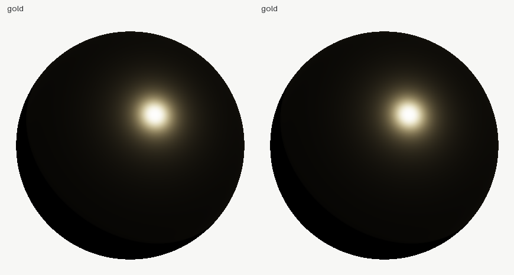

# 04 — production material set: blind vs verified

The commission: eight production PBR materials (gold, aluminum,
copper, red car paint, black rubber, gray plastic, skin, snow) plus a
layered car-paint shader graph — flakes, base coat, fresnel clear
coat. Two attempts at the SAME brief:

- **`blind/`** — a cold-context agent with no tools: JSON authored
  from memory, no renderer, no validator, one shot.
- **`after/`** — the same set with shadersight in the loop: measured
  presets where they exist, every custom material verified, the graph
  costed and optimised.

## The audit's headline: the blind side was GOOD

This example's before/after is not a demolition. The blind agent used
*measured* F0 values from memory — gold (1.0, 0.766, 0.336), copper
(0.955, 0.637, 0.538) — and when the brief dangled a "make it pop,
boost the highlights" bait, it refused: no `boost`, nothing over 1.
The audit's job here was turning its "~90% confident" into fact:

```text
$ python audit_blind.py
gold           ok       max albedo 1.00064
aluminum       ok       max albedo 0.92735
copper         ok       max albedo 0.96366
red_car_paint  warnings max albedo 0.71927
...
audit: 8 materials, 0 failed
```

And the receipts on gold — blind JSON vs the tool's own measured
preset, diffed:

```text
$ shadersight diff audit/gold after/gold
diff: [ok] -> [ok]
  no differences worth reporting
```

The blind agent's gold IS the measured gold. Credit where due.



## What the audit caught — in the TOOL, not the material

The first audit run condemned gold: `max albedo 1.00398 -> VIOLATES`.
But gold's red-channel F0 is *exactly 1.0* — the physical limit — and
a physically exact material cannot violate conservation. Measuring the
estimator instead of trusting it: at the fast grid (4,096 samples) the
Monte-Carlo estimate of an F0=1 mirror reads up to ~1.004 of pure
variance; at 16x samples it converges to 0.999. The tool was wrong,
not the material.

The fix, in shadersight itself: any view over the limit is
**re-measured at 16x samples before it may condemn a material**. The
tolerance is calibrated, not chosen: an exact-limit metal never read
above 1.00064 at the recheck grid across roughness 0.02..1.0, so 1e-3
separates noise from violation there. Two regression tests hold the
line from both sides: exact gold must pass at fast quality, and a
`boost=1.2` cheat must still fail *after* the recheck.

```text
energy: max albedo 1.00064 at 54.09 deg -> CONSERVES
        (grid 64x128, 12 views, over-limit views re-measured at 128x256)
```

## The graph: verified, then made cheap

The blind car-paint graph is structurally sound — the audit proved it:

```text
$ shadersight graph blind/carpaint_graph_blind.json
  reachable: 22/22 nodes; 0 dead, 0 in cycles
  cost: ~436 ALU-equiv/pixel, 0 texture fetch(es) (top: fbm, voronoi, brdf)
  [WARN] the live graph costs ~436 ALU-equivalents per pixel
```

436 ALU/pixel is real money: the procedural flake chain (fbm 200 +
voronoi 120 + shaping) is 73% of it, recomputed every pixel every
frame for a pattern that never changes. The after graph
(`after/carpaint_graph_after.json`) keeps the blind version's exact
two-lobe structure — base BRDF, clear-coat BRDF, fresnel mix — and
bakes the flake mask + height into ONE texture fetch:

```text
$ shadersight graph after/carpaint_graph_after.json
shadersight graph: OK
  reachable: 15/15 nodes; 0 dead, 0 in cycles
  cost: ~204 ALU-equiv/pixel, 1 texture fetch(es)
```

**436 → 204 ALU/pixel, 22 → 15 nodes, same look.**

## Reproduce

```bash
python audit_blind.py     # audits blind/materials_blind.json + the blind graph
python make_after.py      # presets + verified customs + the baked graph + the gold diff
```
